<p align="center">
  
  
  
  
  
  
</p>

<h1 align="center">🖐️ UIControl</h1>
<h3 align="center">AI-Powered Desktop Control with Hand Gestures & Voice</h3>

<p align="center">
  <em>Control your entire Windows desktop with nothing but your hands and voice.<br/>
  An AI agent that sees your screen, understands your intent, and executes autonomously.</em>
</p>

---

## 🎯 What Is This?

**UIControl** is a multimodal desktop automation system that combines:

- **✋ Hand Gesture Control** — Control your mouse cursor and perform clicks, drags, scrolls using webcam hand tracking (MediaPipe)
- **🎤 Voice Commands** — Speak tasks naturally via real-time speech recognition (Silero VAD + NVIDIA Parakeet ASR)
- **🤖 AI Agent** — A Gemini-powered autonomous agent that sees your screen, reasons about it, and executes multi-step tasks
- **🔊 Speech Output** — The agent speaks its responses aloud using Kokoro TTS

> **Think of it as:** Minority Report meets Jarvis — wave your hand to click, speak to command, and let the AI do the rest.

---

## 🏗️ Architecture

```mermaid
graph TB
    subgraph Input["🎮 Input Layer"]
        CAM["📷 Webcam"]
        MIC["🎤 Microphone"]
        KB["⌨️ Keyboard"]
    end

    subgraph Perception["👁️ Perception Layer"]
        MP["MediaPipe<br/>Hand Landmarker"]
        VAD["Silero VAD<br/>+ Smart Turn v3"]
        ASR["NVIDIA Parakeet<br/>CTC 1.1B ASR"]
    end

    subgraph Server["🌐 WebSocket Server :8000"]
        GWS["/ws/gestures"]
        SWS["/ws/speech"]
    end

    subgraph Brain["🧠 WindowsControl"]
        MODE{"Mode Manager"}
        GH["Gesture Handler<br/>+ Cursor Freeze"]
        AGENT["ReAct Agent<br/>(Gemini Flash)"]
        TTS["Kokoro TTS"]
    end

    subgraph Tools["🔧 Tool Layers"]
        SHELL["Shell Layer<br/>PowerShell"]
        UI["UI Automation<br/>a11y + PyAutoGUI"]
        WIN32["Win32 Layer<br/>pywin32"]
        VISION["Vision Layer<br/>Screenshot → Gemini"]
    end

    subgraph Output["📺 Output"]
        SCREEN["Desktop<br/>Mouse/Keyboard"]
        SPEAKER["🔊 Speakers"]
    end

    CAM --> MP --> GWS
    MIC --> VAD --> ASR --> SWS
    KB --> MODE
    GWS --> GH --> SCREEN
    SWS --> AGENT
    MODE -->|Execute| GH
    MODE -->|AutoPilot| AGENT
    AGENT --> Tools --> SCREEN
    AGENT --> TTS --> SPEAKER
```



---

## 📦 Project Structure

```
UIControl/
├── WindowsControl/            # 🧠 Main desktop control system
│   ├── main.py                # Entry point — mode selection CLI
│   ├── mode_manager.py        # Execute Mode & AutoPilot Mode (text + speech)
│   ├── gesture_handler.py     # Gesture → tool action mapping + cursor freeze
│   ├── ws_client.py           # WebSocket consumer with auto-reconnect
│   ├── tts.py                 # Kokoro TTS wrapper (speak / speak_async)
│   ├── config.py              # Screen dimensions, WS URLs, etc.
│   ├── orchestrator/
│   │   ├── agent.py           # ReAct agent loop (Gemini + function calling)
│   │   └── router.py          # Tool routing with smart fallbacks
│   ├── tools/
│   │   ├── base.py            # BaseTool interface, ToolResult, ToolDefinition
│   │   └── __init__.py        # Tool registry
│   ├── layers/
│   │   ├── shell.py           # PowerShell execution layer
│   │   ├── mcp_client.py      # UI Automation (a11y tree + PyAutoGUI)
│   │   ├── win32_layer.py     # Win32 API (window management, COM automation)
│   │   └── vision.py          # Screenshot capture → Gemini vision analysis
│   └── models/                # Kokoro TTS models (gitignored, ~350MB)
│
├── Voice_and_Gesture_Control_UI/  # 👁️ Perception clients
│   ├── gesture_client.py      # MediaPipe hand tracking + gesture engine v4
│   ├── speech_client.py       # Silero VAD + Smart Turn + NVIDIA Parakeet ASR
│   ├── server.py              # FastAPI WebSocket hub (:8000)
│   ├── smart_turn_inference.py # ML end-of-turn detection model
│   └── models/                # Hand landmarker + VAD + Smart Turn models
│
└── AIClient-2-API/            # 🔌 AI proxy server
    └── ...                    # Multi-provider LLM API proxy
```

---

## ✋ Gesture System

The gesture engine uses **MediaPipe Hand Landmarker** (float16) to detect 21 hand landmarks at 30 FPS, then maps finger pinch patterns to desktop actions:

| Gesture | How To Perform | Action |
|---------|---------------|--------|
| **Tap** | Thumb touches index finger, quick release (<200ms) | Left click |
| **Double Tap** | Thumb touches middle finger, quick release | Double click |
| **Pinch Hold** | Thumb + index finger held together (>500ms) | Right click |
| **Pinch Drag** | Thumb + index pinched, move hand | Drag & drop |
| **Pinch Flick** | Thumb + index pinched, fast release | Scroll |

### 🎯 Cursor Freeze
When you start a pinch gesture, the cursor **freezes in place** — your hand can drift during the pinch without affecting where the click lands. This dramatically improves click precision.

### Gesture Engine Internals
- **Hysteresis thresholds** prevent jitter (separate on/off distances)
- **EMA smoothing** (α=0.35) for silky cursor movement
- **Edge remapping** stretches the comfortable hand area to reach all screen edges
- **Ghost prevention** blocks accidental taps after double-tap cooldown

---

## 🎤 Speech System

A full speech pipeline that runs **mostly local** with cloud ASR only for final transcription:

```
🎤 Mic (16kHz mono)
 └→ Silero VAD (LOCAL neural voice activity detection)
     └→ Speech detected? Accumulate audio buffer
         └→ Silence detected? → Smart Turn v3 (LOCAL ML end-of-turn)
             └→ End-of-turn confirmed? → NVIDIA Parakeet ASR (CLOUD gRPC)
                 └→ Final transcript → WebSocket → Agent
```

| Component | Model | Runs |
|-----------|-------|------|
| Voice Activity Detection | Silero VAD v5 | Local (ONNX) |
| End-of-Turn Detection | Smart Turn v3.2 | Local (ONNX) |
| Speech Recognition | NVIDIA Parakeet CTC 1.1B | Cloud (gRPC) |
| Text-to-Speech | Kokoro v1.0 (82M params) | Local (ONNX) |

---

## 🤖 AI Agent

The **ReAct Agent** (Reason + Act) uses Gemini Flash to autonomously execute desktop tasks:

1. **Observe** — Captures desktop state: list of windows, active app, UI elements via accessibility tree
2. **Reason** — Plans the minimal set of actions needed
3. **Act** — Executes tools via function calling
4. **Verify** — Screenshots the result after state-changing actions for visual confirmation

### Available Tools (20+)

| Category | Tools |
|----------|-------|
| **Screen** | `snapshot`, `click`, `type_text`, `scroll`, `drag_and_drop`, `hover`, `select_text`, `keyboard_shortcut` |
| **Windows** | `list_windows`, `window_control`, `window_move_resize` |
| **System** | `open_app`, `open_url`, `clipboard_op`, `process_manage`, `system_info`, `screen_info` |
| **Files** | `file_operations`, `com_automate` |
| **Shell** | `run_shell` (PowerShell with output capture) |

### Tool Layers
The agent has **4 independent tool layers** that provide overlapping capabilities with smart fallback:

1. **Shell Layer** — PowerShell commands for system control
2. **UI Automation Layer** — Windows Accessibility tree + PyAutoGUI for pixel-precise interactions
3. **Win32 Layer** — Native Windows API via pywin32 for window management and COM automation
4. **Vision Layer** — Screenshots analyzed by Gemini for visual understanding

---

## 🚀 Quick Start

### Prerequisites
- **Windows 10/11** with Python 3.11+
- **Webcam** (for gesture control)
- **NVIDIA API Key** (for speech recognition — [get one free](https://build.nvidia.com))
- **Gemini API access** via Antigravity Proxy on `localhost:8888`

### 1. Install Dependencies

```bash
# WindowsControl (core system)
cd WindowsControl
pip install -r requirements.txt

# Voice & Gesture clients
cd ../Voice_and_Gesture_Control_UI
pip install -r requirements.txt
```

### 2. Download TTS Models

```bash
cd WindowsControl/models
# Kokoro TTS (~350MB total)
wget https://github.com/thewh1teagle/kokoro-onnx/releases/download/model-files-v1.0/kokoro-v1.0.onnx
wget https://github.com/thewh1teagle/kokoro-onnx/releases/download/model-files-v1.0/voices-v1.0.bin
```

### 3. Set Environment Variables

```bash
set NVIDIA_API_KEY=nvapi-your-key-here
```

### 4. Start the System

```bash
# Terminal 1: Start the WebSocket server
cd Voice_and_Gesture_Control_UI
python server.py

# Terminal 2: Start the gesture client (opens webcam)
cd Voice_and_Gesture_Control_UI
python gesture_client.py

# Terminal 3: (Optional) Start the speech client
cd Voice_and_Gesture_Control_UI
python speech_client.py

# Terminal 4: Launch the main control system
cd WindowsControl
python main.py
```

You'll see the mode selection menu:

```
╦ ╦╦╔╗╔╔╦╗╔═╗╦ ╦╔═╗  ╔═╗╔═╗╔╗╔╔╦╗╦═╗╔═╗╦
║║║║║║║ ║║║ ║║║║║╚═╗  ║  ║ ║║║║ ║ ╠╦╝║ ║║
╚╩╝╩╝╚╝═╩╝╚═╝╚╩╝╚═╝  ╚═╝╚═╝╝╚╝ ╩ ╩╚═╚═╝╩═╝

Select Operating Mode:
  [1]  🤚  Execute Mode        — gesture control
  [2]  🤖  AutoPilot Mode      — AI agent (text or speech input)
```

---

## 🎮 Usage Modes

### Execute Mode ✋
Your hand becomes the mouse. The webcam tracks your hand in real-time and maps gestures to desktop actions. The cursor follows your index finger with smooth EMA tracking and edge remapping.

### AutoPilot Mode 🤖
The AI agent takes commands and executes them autonomously. Choose your input method:

- **⌨️ Text Input** — Type tasks in a REPL (`Open Chrome and go to YouTube`)
- **🎤 Speech Input** — Speak tasks naturally (requires speech client running)

Both modes speak results aloud via **Kokoro TTS**.

**Example tasks:**
```
> Open Notepad and type "Hello World"
> What applications are currently running?
> Take a screenshot and describe what you see
> Move the browser window to the left half of the screen
> Search for "weather" in Chrome
```

---

## 🔧 Configuration

Key settings in `WindowsControl/config.py`:

| Setting | Default | Description |
|---------|---------|-------------|
| `SCREEN_WIDTH` | 1920 | Screen resolution width |
| `SCREEN_HEIGHT` | 1080 | Screen resolution height |
| `GESTURE_WS_URL` | `ws://localhost:8000/ws/gestures` | Gesture WebSocket endpoint |
| `SPEECH_WS_URL` | `ws://localhost:8000/ws/speech` | Speech WebSocket endpoint |
| `LLM_BASE_URL` | `http://localhost:8888/v1` | Gemini proxy URL |

Gesture tuning in `gesture_handler.py`:

| Setting | Default | Description |
|---------|---------|-------------|
| `SMOOTHING_FACTOR` | 0.35 | Cursor smoothing (0=frozen, 1=raw) |
| `EDGE_MARGIN` | 0.08 | Dead zone at screen edges |

---

## 🧪 Testing

```bash
cd WindowsControl
python test_all.py            # Run all unit tests
python test_integration.py    # Full integration tests
python test_stateful_flow.py  # Multi-step task flows
```

---

## 📄 License

MIT

---

<p align="center">
  <strong>Built with 🤖 AI + 🖐️ gestures + 🎤 voice</strong><br/>
  <em>The future of desktop interaction is multimodal.</em>
</p>
